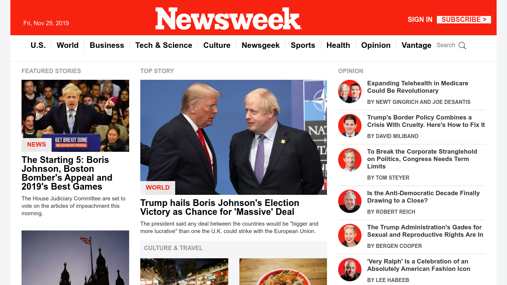

# Project:- Newsweek

> This project consists of building an HTML document that matches the appearance of newsweek.com website

Use of Bootstrap in Designing, Positioning and floating of elements to make this site Responsive.

## Built With

- HTML and CSS,
- Bootstrap

## Live Demo

[Live Demo Link](https://rawcdn.githack.com/hemant-soni-vst-au4/Newsweek/eb5b3ae7311120e1c6f3560b311d6cf64dd92722/index.html)

## Authors

👤 **Hemant soni**

- Github: [@hemant-soni-vst-au4](https://github.com/hemant-soni-vst-au4)
- Twitter: [@Hemants63203059](https://twitter.com/Hemants63203059)
- Linkedin: [linkedin](https://www.linkedin.com/in/hemant-soni-97427b193/)

## 🤝 Contributing

Contributions, issues and feature requests are welcome!

Feel free to check the [issues page]().

## Show your support

Give a ⭐️ if you like this project!

## Acknowledgments

- Hat tip to anyone whose code was used
- Inspiration
- etc

## 📝 License

This project is [MIT](lic.url) licensed.
